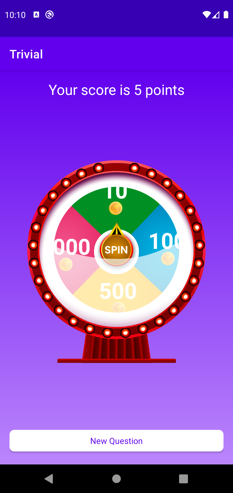
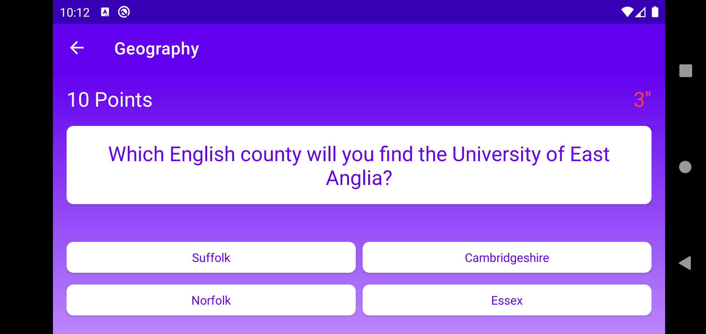

# Trivial

Repository to show Single Activity architecture, testing and some android technologies.

Init question                 | Correct answer                 | Incorrect answer                 | Game finished
----------------------------- | ------------------------------ | -------------------------------- | -----------------------------
 |  |  | 

Landscape variations.       |                             |
--------------------------- | --------------------------- |
 |  |

### Architecture
- Clean architecture
- Single Activity
- MVVM

### Testing
- Mockito
- Coroutine test

### Technologies
- Retrofit & OkHttp
- Coroutines
- Hilt
- Navigation component
- ViewModel & Livedata
- View Binding & Data Binding
- Lottie animations

[Trivia Database](https://opentdb.com)
